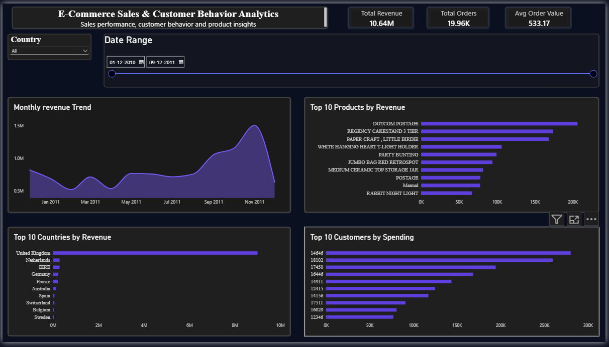

# E-commerce Customer Behavior and Sales Analytics

## Project Overview

This project analyzes e-commerce transaction data to understand sales performance, revenue patterns, product-level performance, and customer purchasing behavior.

The project uses Python, SQL, and Power BI to transform raw transaction data into meaningful business insights and an interactive dashboard.

## Business Problem

E-commerce businesses generate large volumes of transaction data, but raw transaction records alone do not provide a clear view of business performance.

This project focuses on answering questions such as:

* What is the overall revenue generated?
* Which products generate the highest revenue?
* Which products have low or zero revenue?
* Which months show stronger sales performance?
* How can transaction data be transformed into useful business insights?

## Objectives

* Clean and prepare raw e-commerce transaction data.
* Analyze sales and revenue trends.
* Identify high- and low-performing products.
* Explore customer purchasing behavior.
* Perform SQL-based business analysis.
* Build an interactive Power BI dashboard.
* Present business findings and recommendations.

## Dataset

The project uses the **Online Retail** transaction dataset from a UK-based online retailer.

The dataset contains approximately 541,909 transaction records and includes fields such as:

* Invoice Number
* Stock Code
* Product Description
* Quantity
* Invoice Date
* Unit Price
* Customer ID
* Country

The raw dataset contains real-world data quality issues such as missing customer information, duplicate records, cancelled transactions, negative quantities, and zero or negative unit prices.

## Tools and Technologies

**Python**
  * Pandas
  * NumPy
  * Matplotlib
  * Seaborn
**SQL / MySQL**
**Power BI**
**Jupyter Notebook**
**GitHub**

## Project Workflow

Raw Dataset
     ↓
Data Exploration
     ↓
Data Cleaning
     ↓
Feature Creation
     ↓
SQL Analysis
     ↓
Power BI Dashboard
     ↓
Business Insights

## Data Preparation

The data preparation process included:

1. Reviewing the dataset structure and data types.
2. Standardizing column names.
3. Converting invoice dates into the correct datetime format.
4. Identifying and removing duplicate records.
5. Handling missing values in essential transaction fields.
6. Identifying cancelled transactions.
7. Removing invalid transactions with non-positive quantities or unit prices from the primary sales analysis.
8. Creating a revenue field using:

Revenue = Quantity × Unit Price

The cleaned dataset was then used for analysis and Power BI visualization.

## Key Findings

The analysis produced the following findings:

**Total Revenue:** 10.64M
**Highest Revenue Item:** Dotcam postage — 206,248.77
**Lowest Revenue Item:** Pads to match all cushions — 0.00
**Highest Revenue Month:** December — 254,449.17

These findings highlight differences in product-level revenue performance and monthly sales patterns.

## Power BI Dashboard

The Power BI dashboard provides an interactive view of the analyzed sales data.

It includes:

* Revenue KPI
* Product-level analysis
* Monthly revenue analysis
* Interactive filtering
* Visual sales performance analysis

### Dashboard Preview

## Business Recommendations

Based on the analysis:

1. **Investigate high-revenue products** to understand their contribution to overall sales and identify opportunities for stronger promotion.

2. **Investigate zero-revenue products** to determine whether they represent data-quality issues, promotional items, or products that require business attention.

3. **Analyze December performance** to understand the factors contributing to stronger monthly revenue.

4. **Use interactive dashboards** to monitor sales performance and support faster business decision-making.

## Project Structure

ecommerce-customer-behavior-sales-analytics/
│
├── data/
│   ├── raw/
│   └── processed/
│
├── notebooks/
│   ├── 01_data_exploration.ipynb
│   └── 02_data_cleaning.ipynb
│
├── sql/
│   ├── schema.sql
│   └── analysis_queries.sql
│
├── dashboard/
│   └── ecommerce_dashboard.pbix
│
├── reports/
│   └── insights.md
│
├── images/
│   └── dashboard.png
│
├── requirements.txt
└── README.md

## How to Run the Project

### 1. Clone the repository

Clone this repository to your local computer.

### 2. Install Python dependencies

pip install -r requirements.txt

### 3. Run the notebooks

Open the notebooks using Jupyter Notebook or JupyterLab and run them in sequence:

01_data_exploration.ipynb
02_data_cleaning.ipynb

### 4. SQL Analysis

The SQL scripts can be executed in MySQL after creating the database and sales table using:

sql/schema.sql

### 5. Power BI Dashboard

Open:

dashboard/ecommerce_dashboard.pbix

using Power BI Desktop.

## Limitations

* The dataset represents historical transaction activity.
* Revenue should not be interpreted as profit because costs, discounts, and other expenses are not included.
* Missing customer information limits some customer-level analysis.
* The dataset does not provide detailed information about marketing campaigns, product costs, or customer demographics.
* Additional business data would be required to establish causes behind observed sales patterns.

## Future Improvements

Potential future improvements include:

* Customer segmentation using RFM analysis.
* Advanced customer lifetime value analysis.
* Automated ETL pipelines.
* Cloud data warehouse integration.
* Scheduled Power BI data refresh.
* More advanced sales forecasting.
* Additional customer and product-level KPIs.

## Author

**Sai Tejasri Kotla**

B.Tech Information Technology Graduate

Skills: Python | SQL | Data Analysis | Power BI | Data Engineering
